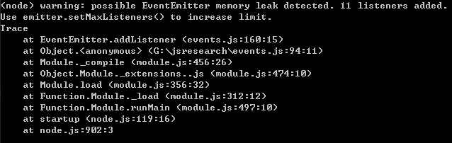

##### 继承
之前我们在介绍Utilities模块的时候，遗留了最后一个方法（util.inherits）没有说。这是因为把此方法放到events模块一起讲更合适，不是说events模块对此方法有什么依赖，而是我们在使用events时，利用node提供的继承方法可以更方便和快捷。

##### util.inherits(constructor, superConstructor)
从字面上我们可以很清楚的知道，此方法是用来做JavaScript里面的继承功能的。参数如下：

+ 第一个参数（constructor）表示子类

+ 第二个参数（superConstructor）表示父类

与JavaScript复杂的继承代码相比，使用此函数确实非常方便。

```js
var util = require('util');

var People = function(info){
  this.name = info.name;
  this.age = info.age;
}

People.prototype.showName = function() {
  return util.format('My name is %s,', this.name);
}

People.prototype.showAge = function() {
  return util.format('I am %d years old.', this.age);
}

var Chinese = function(info){
  People.call(this, info);
}
util.inherits(Chinese, People);

Chinese.prototype.introduce = function(){
  return  '你好！' + this.showName() + this.showAge();
}

var chinese_poople = new Chinese({name: 'peter', age: 28});

console.log(chinese_poople.introduce()); // 你好！My name is peter,I am 28 years old.
```

首先我们定义了People（父类）和Chinese（子类），然后利用util.inherits使Chinese继承了People。在Chinese中直接可以调用showName和showAge方法，表明util.inherits方法的继承效果已经生效了。util.inherits非常简单，只要提供2个参数即可，没有太多的花花肠子。

##### events
现在进入我们今天真正的主题，events（下称事件）模块是node的核心模块之一。在node中，事件可谓是无处不在。例如在[Node.js之HTTP](https://github.com/swfbarhr/blog/blob/master/node/http.md)提到过的server.on('request', function(){})就是处理request事件。而如果想要实现事件的推送与接收，我们必须要要继承events.EventEmitter

##### events.EventEmitter
只要继承了events.EventEmitter类，我们就可以正常使用emit方法和on方法来推送、接收事件。这里需要注意的是，'error'事件很特殊。如果我们没有监听'error'事件的话，一旦程序发成了错误，node就会在控制台上打印出调用栈，并且退出程序。

##### 监听事件 emitter.addListener(event, listener)、emitter.on(event, listener)
监听事件可以有2中写法一种是addListener，addListener方法有2个参数：第一个参数是事件名称（命名格式一般是驼峰式），第二个参数是对事件的处理函数。

```js
var util = require('util');
var EventEmitter = require('events').EventEmitter;

var _eventDemo = function(){
  EventEmitter.call(this);
}

util.inherits(_eventDemo, EventEmitter);

var _eventInstance = new _eventDemo();

_eventInstance.addListener('connection', function(params){
  util.log('连接成功！'); // 3 Mar 14:11:36 - 连接成功！
  console.log(params); // { username: 'admin', pwd: '123' }
});

util.log('开始连接...'); // 3 Mar 14:11:31 - 开始连接...
setTimeout(function(){
  _eventInstance.emit('connection', {username:'admin', pwd:'123'});
}, 5000);
```

首先我们定义了_eventDemo并继承了EventEmitter。既然继承了EventEmitter，就可以使用addListener和on。然后我们就定义了事件'connection'和处理函数，为了方便起见，我在合适的位置打印了日志信息。当我们运行以上代码的时候，首先会打印“开始连接...”，等待5秒之后屏幕上回出现“连接成功！”，并且接着打印我们在触发事件（emit）时所传入的参数。这就表明我们的监听是可以正常运行的。

监听事件的另一个方法（on），与addListener用法是一模一样的，大家可以自己试试，这里就不多讲了。

##### emitter.once(event, listener)
此方法与emitter.once方法功能一致，唯一的却别就是，此方法对应一个emitter实例即使推送多次，其所监听的事件也只触发一次：

```js
var util = require('util');
var EventEmitter = require('events').EventEmitter;

var _eventDemo = function(){
  EventEmitter.call(this);
}

util.inherits(_eventDemo, EventEmitter);

var _eventInstance = new _eventDemo();

_eventInstance.once('connection', function(){
  console.log('once');
});

_eventInstance.on('connection', function(){
  console.log('ok')
});

_eventInstance.emit('connection'); // once
                                   // ok
_eventInstance.emit('connection'); // ok
```

如果我们运行以上代码，可以看到，即使我们触发了2次'connection'事件。当我们用_eventInstance.on来监听事件时，确实会触发2次；但是_eventInstance.once监听的事件却只触发了一次。这就是emitter.once的与emitter.on最大的区别。

##### emitter.removeListener(event, listener)
此方法是emitter.on方法的逆，此方法会移除掉对应的监听事件。需要注意的是，如果同一事件被监听了多次，那么也需要多次调用emitter.removeListener才能将其全部移除。

```js
var util = require('util');
var EventEmitter = require('events').EventEmitter;

var _eventDemo = function() {
  EventEmitter.call(this);
}

util.inherits(_eventDemo, EventEmitter);

var _eventInstance = new _eventDemo();

var cb = function() {
  console.log('ok')
}

_eventInstance.on('connection', cb);

_eventInstance.removeListener('connection', cb);

_eventInstance.emit('connection'); // 这里什么都不会发生
```

```js
var util = require('util');
var EventEmitter = require('events').EventEmitter;

var _eventDemo = function() {
  EventEmitter.call(this);
}

util.inherits(_eventDemo, EventEmitter);

var _eventInstance = new _eventDemo();

var cb = function() {
  console.log('ok')
}

_eventInstance.on('connection', cb);
_eventInstance.on('connection', cb);

_eventInstance.removeListener('connection', cb);

_eventInstance.emit('connection'); // ok
```

上面2段代码，第一段代码我们添加了一个'connection'监听事件，并且移除了一次，运行代码之后什么事情都没有发生。第二段代码我们添加了两个'connection'监听事件，只移除了一次，所有在推送'connection'事件之后，会触发一次。

##### emitter.removeAllListeners([event])
移除所有监听事件

```js
var util = require('util');
var EventEmitter = require('events').EventEmitter;

var Server = function() {
  EventEmitter.call(this);
}

util.inherits(Server, EventEmitter);

var server1 = new Server();

var connected = function() {
  console.log('connected');
}

var data = function() {
  console.log('data')
}

server1.on('connected', connected);
server1.on('data', data);

server1.emit('connected'); // connected
server1.emit('data'); // data

server1.removeAllListeners();

console.log('all listeners are removed');

server1.emit('connected'); // 什么事也没发生
server1.emit('data'); // 什么事也没发生
```

emitter.removeAllListeners有一个可选参数，如果传入该参数，表示移除所有指定事件名称的所有监听。大家可以自己试一下。

##### emitter.setMaxListeners(n)
node默认同一对象的同一事件监听超过十次，就会发出警告信息。这可以帮助我们这个noder更好的找出令人烦恼的且蛋疼的内存泄露问题，因为内存泄露很多时候我们连原因都不知道，更不要说去修复问题了。

```js
var util = require('util');
var EventEmitter = require('events').EventEmitter;

var Server = function() {
  EventEmitter.call(this);
}

util.inherits(Server, EventEmitter);

var server1 = new Server();

var connected = function() {
  console.log('connected');
}

for(var i = 0;i <= 10;i++){
  server1.on('connected', connected);
}
```

如果我们运行以上代码，并且不会任何其他设置的话，就会得到以下的结果：



但是如果对以上代码稍作修改的话，就会避免警告的发生

```js
var util = require('util');
var EventEmitter = require('events').EventEmitter;

var Server = function() {
  EventEmitter.call(this);
}

util.inherits(Server, EventEmitter);

var server1 = new Server();

var connected = function() {
  console.log('connected');
}

server1.setMaxListeners(11);

for(var i = 0;i <= 10;i++){
  server1.on('connected', connected);
}

console.log(emitter.listeners('connected'))
```

我们可以指定上限数量，也可以这样

```js
emitter.setMaxListeners(0);
```

将参数设为0表示不设置监听上限数量，意味着这样一来，我们可以添加任意多个监听事件。

##### emitter.listeners(event)
返回指定事件的所有监听函数的集合。

```js
var util = require('util');
var EventEmitter = require('events').EventEmitter;

var Server = function() {
  EventEmitter.call(this);
}

util.inherits(Server, EventEmitter);

var server1 = new Server();

var connected = function() {
  console.log('connected');
}

for(var i = 0;i <= 2;i++){
  server1.on('connected', connected);
}

console.log(server1.listeners('connected')); // [ [Function], [Function], [Function] ]
```

##### emitter.emit(event, [arg1], [arg2], [...])
触发或推送事件和指定参数（之前已经用的够多了，不需要再额外解释了）。

##### EventEmitter.listenerCount(emitter, event)
获取指定实例上，指定事件的数量。

```js
var util = require('util');
var EventEmitter = require('events').EventEmitter;

var Server = function() {
  EventEmitter.call(this);
}

util.inherits(Server, EventEmitter);

var server1 = new Server();

var connected = function() {
  console.log('connected');
}

for(var i = 0;i <= 2;i++){
  server1.on('connected', connected);
}

console.log(EventEmitter.listenerCount(server1, 'connected')); // 3
```

##### 事件'newListener'和'removeListener'
每次为实例添加任意事件时触发'newListener'、每次为实例移除任意事件时触发'removeListener'

```js
var util = require('util');
var EventEmitter = require('events').EventEmitter;

var Server = function() {
  EventEmitter.call(this);
}

util.inherits(Server, EventEmitter);

var server1 = new Server();

var connected = function() {
  console.log('connected');
}

server1.on('newListener', function(){
  console.log('new listener is added!');
});

server1.on('removeListener', function(){
  console.log('a listener is removed!');
});

for(var i = 0;i <= 9;i++){
  server1.on('connected', connected);
}

for(var i = 0;i <= 3;i++){
  server1.removeListener('connected', connected);
}
```

##### 总结
如果想要学好node，必须要彻底的了解事件的机制。因为事件时node的基础中的基础。好了，事件模块介绍到这里，就全部介绍完成了，如果需要熟练掌握，还是要多练习或者在实际项目中多运用才行。
